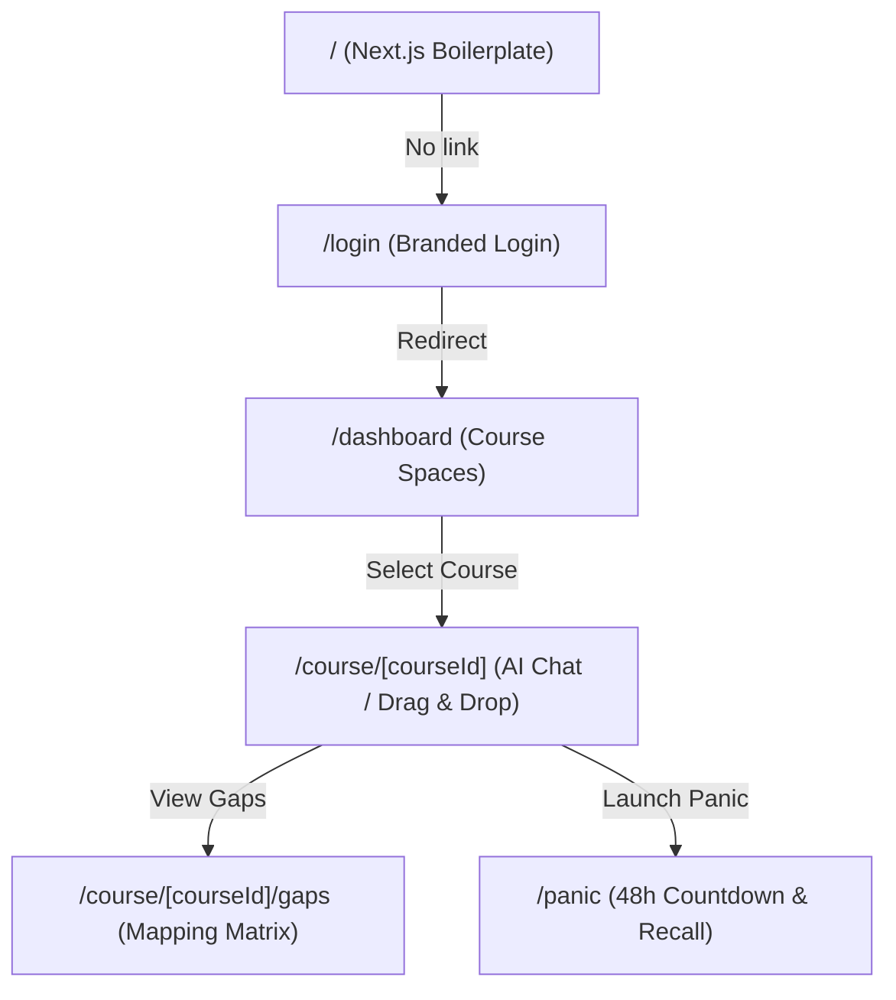

# Project Sankofa: Structural & Implementation Analysis

This analysis evaluates the current implementation of **Project Sankofa** against the specifications outlined in the project's charter (`Sankofa_Project_Charter.txt`). 

---

## Executive Summary

While the frontend contains the visual pages and routes representing the target user flow, **the project is currently a visual-only prototype**. There is a major mismatch between the backend architecture specified in the Project Charter and what exists in the repository. The core logic files are empty, backend requirements are inconsistent, and branding is fractured across multiple names.

---

## 1. Technical Stack & Backend Gaps

The charter defines a fully functioning retrieval-augmented generation (RAG) system with a FastAPI backend and ChromaDB vector store. The current implementation details are analyzed below:

| Dimension | Charter Specification | Actual Implementation | Status |
| :--- | :--- | :--- | :--- |
| **Backend Framework** | Python FastAPI (Section 14) | None (Streamlit is in `requirements.txt`) | ❌ **Critical Mismatch** |
| **API Endpoints** | Stateless upload, gap-detection, chat, and panic-mode endpoints | Files exist but are **completely empty** | ❌ **Not Implemented** |
| **Vector DB** | ChromaDB with per-course vector namespaces | ChromaDB is installed but no database logic is written | ❌ **Not Implemented** |
| **OCR Pipeline** | Tesseract OCR for scanned/handwritten notes | No OCR libraries or logic are present | ❌ **Not Implemented** |
| **Document Processing** | PyPDF / pdfplumber | `pdfplumber` listed in dependencies, but no parser is implemented | ❌ **Not Implemented** |

### Core File Status
- [app.py](file:///c:/Users/DELL/Downloads/Lighthub/Project_Sankofa/app.py) — `0 bytes` (Empty file intended for FastAPI entry point)
- [ai_logic.py](file:///c:/Users/DELL/Downloads/Lighthub/Project_Sankofa/ai_logic.py) — `0 bytes` (Empty file intended for RAG, embedding, and LLM orchestration)
- [file_processing.py](file:///c:/Users/DELL/Downloads/Lighthub/Project_Sankofa/file_processing.py) — `0 bytes` (Empty file intended for PDF parsing and Tesseract OCR)

> [!WARNING]
> The [requirements.txt](file:///c:/Users/DELL/Downloads/Lighthub/Project_Sankofa/requirements.txt) file contains `streamlit` instead of `fastapi` or `uvicorn`. This indicates a deviation from the FastAPI backend architecture defined in the charter.

---

## 2. Frontend Navigation & Mock Data Status

The frontend is built using **Next.js 16.2.10** and **React 19.2.4**. The file-system directory hierarchy exists and handles client-side page routing, but all data and operations are mocked.

### Key Gaps in Frontend Pages

#### 1. Boilerplate Root Landing Page
- **Path**: [page.js](file:///c:/Users/DELL/Downloads/Lighthub/Project_Sankofa/app/page.js)
- **Status**: It contains the standard, unmodified Next.js starter page. It does not route or refer to the login page (`/login`) or dashboard, making it impossible to navigate to the app from the root URL without manual path entry.
- **Metadata**: [layout.js](file:///c:/Users/DELL/Downloads/Lighthub/Project_Sankofa/app/layout.js) still contains default template metadata: `"Create Next App"` and `"Generated by create next app"`.

#### 2. Workspace & File Upload
- **Path**: [page.jsx (Workspace)](file:///c:/Users/DELL/Downloads/Lighthub/Project_Sankofa/app/course/[courseId]/page.jsx)
- **Status**: The drag-and-drop file upload component is a UI-only component with no upload API or backend target.
- **RAG Chat**: The AI Co-pilot chat simulator uses a client-side `setTimeout` to return hardcoded answers: `"I'm processing that query against your indexed PDFs. (Backend FastAPI endpoint connection goes here!)"`.

#### 3. Curriculum Gap Detector
- **Path**: [page.jsx (Gaps)](file:///c:/Users/DELL/Downloads/Lighthub/Project_Sankofa/app/course/[courseId]/gaps/page.jsx)
- **Status**: Uses static mock modules/topics. The `"Patch Context Gap"` button simulates a backend notes generation process entirely in client state using a timer.

#### 4. Exam Panic Mode
- **Path**: [page.jsx (Panic)](file:///c:/Users/DELL/Downloads/Lighthub/Project_Sankofa/app/panic/page.jsx)
- **Status**: The flashcards (Active Recall Matrix), cheat notes, and the 48-hour schedule are completely static and hardcoded. The charter calls for these to be generated dynamically from the student's actual uploaded documents and course outlines.

---

## 3. Branding Inconsistencies

The branding is fragmented across the repository and documentation:

- **Project Charter**: Refers to `"AI Academic Survival Copilot"` (and folder is named `Project_Sankofa`).
- **README.md**: Refers to the project as `"Lighthub.ed"`.
- **Frontend Pages**:
  - The login page and dashboard display the branding logo **⚡ STUN-FI NOTES** and footer **STUN-FI HUB**.
  - The gaps detector displays **STUN-FI HUB — GAP DETECTOR** in the navigation bar.

---

## Summary of Corrective Actions Needed

To make the project structure fully meet the specifications in the project charter, the following tasks must be completed:

1. **Clean up Root Landing Page & Metadata**: Modify `/app/page.js` to serve as a proper landing page linking to `/login`, and update title/description metadata in `/app/layout.js`.
2. **Standardize Branding**: Reconcile naming differences ("Sankofa", "Lighthub.ed", "STUN-FI") to present a cohesive brand identity in the UI.
3. **Configure Python Dependencies**: Update `requirements.txt` to include `fastapi`, `uvicorn`, `jinja2`, `pytesseract` (or other OCR libraries), and any other dependencies needed for the RAG engine.
4. **Implement Backend Services**:
   - Write file processing logic in `file_processing.py` (PDF parser + OCR).
   - Write embedding and vector-search queries in `ai_logic.py`.
   - Setup FastAPI routing and endpoints in `app.py`.
5. **Connect Frontend to Backend APIs**: Replace Next.js mock states with fetch calls to the FastAPI endpoints for document upload, RAG chatting, gap patching, and Panic Mode generation.
